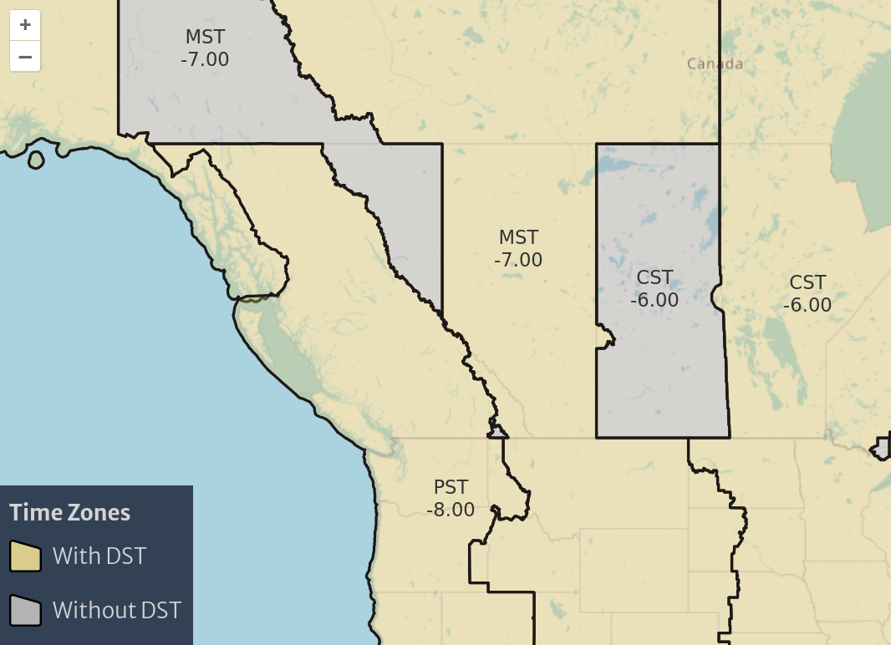

# Laravel Inertia

Typescript and React on the front-end, many features out of the box
on the back-end, and components as responses.

## Demo

This includes some articles, and a TimeZone map. Most content can be
found in `resources/js/`.

## Running Dev

First, see Laravel install instructions for installing `php` and `composer`.  
Then try `composer run dev` from the project root.

## Dev Setup

- VS Code or Neovim
- Extensions
  - ESLint
  - MDX
  - PHP Intelephense
  - Prettier
  - Prettier-ESLint
  - Tailwind CSS IntelliSense

Check if ESLint is working. Check that autoformatting works, too.
Prettier should sort tailwind classes, and that sorting can prevent issues.

### Sail

- `sail:install`
- `sail:publish`
- `sail:add`, which allows easy installation of
  - redis
  - mariadb
  - pgsql
  - and more, see `./vendor/laravel/sail/stubs/`

## Try a Cache

Try ValKey in a container: https://github.com/valkey-io/valkey-container
